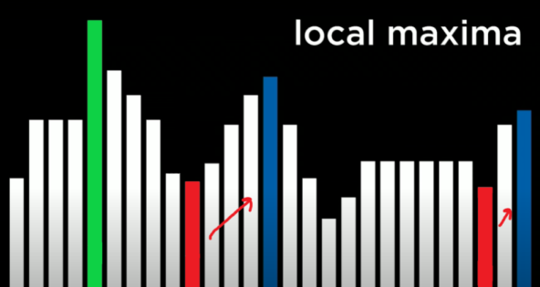

# Optimization - CS50AI Lecture 3

Choosing the best option from a set of options

## Local Search:

Search Algorithms that maintain a **single** node and searches by moving to a neighboring node. This differs from algorithms like BFS and DFS as they maintain multiple nodes in the frontier. Let's imagine an example where given 4 houses, you have to place 2 hospitals such that the distances from the houses to the hospitals are minimized.


## State-Space Landscape:

We can think of the above example from a more abstract perspective using state-space landscapes. Each bar represents a particular configuration of hospitals and the height of each bar generally represents some function of that state. In this case, it could represent the path cost.


### Objective Function:

The function we are trying to optimize while finding the **global maximum** from a number of states.

### Cost Function:

The function we are trying to optimize while finding the **global minimum** from a number of states. In the case of houses and hospitals, this function would be used for distance.

## Hill Climbing:

### Find Max:
Starts at a given state. If left state is higher, goes left. If right state is higher, goes right. If both are less, terminates.

### Find Min:
Starts at a given state. If left state is lower, goes left. If right state is lower, goes right. If both are higher, terminates.

### Pseudocode:

```python
function Hill-Climb(problem):
    current = initial state of a problem
    repeat:
        neighbor = highest valued neighbor of current
        # If none are better, then return
        if neighbor better than current:
            return current
        # Go to higher value
        else:
            current = neighbor
```

### Hill Climbing Limitations:

It doesn't always find the global maximum/minimum


### Hill Climbing Variants:

| Variant           | Definition                                    |
|-------------------|-----------------------------------------------|
| Steepest-Ascent   | Choose the highest valued neighbor            |
| Stochastic        | Choose randomly from highest valued neighbors |
| First Choice      | Choose the first highest valued neighbor      |
| Random-restart    | Conduct Hill Climbing mutliple times          |
| Local Beam Search | Chooses the _k_ highest-valued neighbors      |

Even with these variants, hill climbing poses the problem that we'll never reliably be able to find the global maxima or minima. Hill climbing never makes a decision to go to a state that is worse and ultimately, we will need to do that in order to find the **best** case(example of why above).

## Simulated Annealing:

- Early on, higher "temperature": more likely to accept neighbors that are worse than current state.
- Later on, lower "temperature": less likely to accept neighbors that are worse than current state.

```python
function Simulated-Annealing(problem, max):
    current = initial state of problem
    for t = 1 to max:
        # calculated temperature based on time, in this case, t (How far into the process we are).
        T = temperature(t)
        neighbor = random neighbor of current
        ΔE = how much better neighbor is than current
        if ΔE > 0:
            current = neighbor
        # In some cases, we want to choose a neighbor that is worse and this is based on two things, the temperature and
        # how much worse it is compared to current: T and ΔE.
        With probability e^(ΔE/T), set current = neighbor
```

This allows us to dislodge ourselves and explore spaces whcih will ultimately have the best values.

## Linear Programming:

- Minimize a cost function 
- With constraints of from  or of form

- With bounds for each variable 

### Linear Programming Application Problem:

- Two machines `X1` and `X2`. `X1` costs $50/hour to run, `X2` costs $80/hour to run. Goal is to minimize cost.
- `X1` requires 5 units of labour per hour. `X2` requires 2 units of labor per hour. Total of 20 units of labor to spend.
- `X1` produces 10 units of output per hour. `X2` produces 12 units of output per hour. Company needs at least 90 unites of output.

- **Cost Function:** 
- **Constraint:** 
- **Constraint:**  or 
+(-12x_2)%20\leq%20-90)