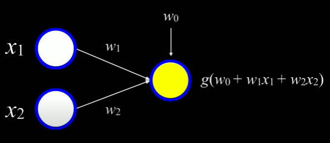
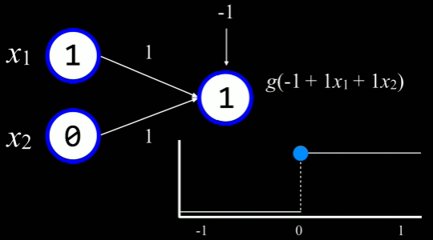
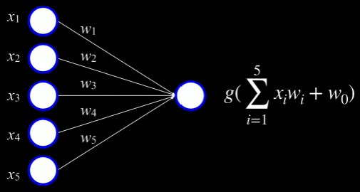
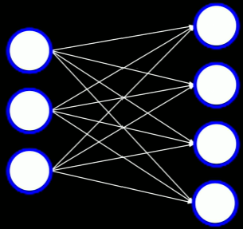
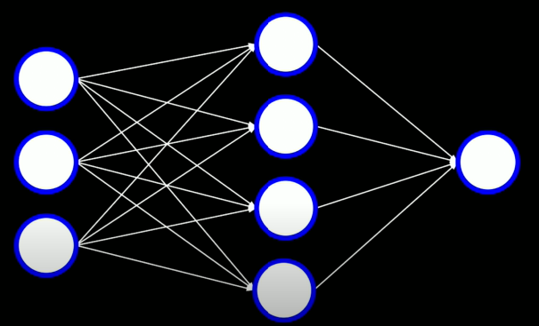
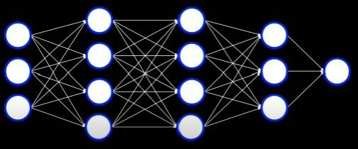
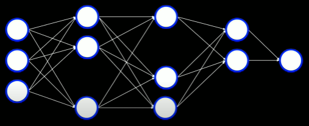

# Neural Networks - CS50AI Lecture 5

Biological neural networks are a system in the human body that consist of three stages: receptors, a neural network, and effectors. The receptors receive the stimuli either internally or from the external world, then pass the information into the neurons in a form of electrical impulses.

## Artificial Neural Networks:

- Mathematical model for learning inspired by biological neural networks that constitute animal brains. It works by mapping inputs to outputs based on the structure and parameters of the network.
- Allows for learning the network's parameters based on data.

To model this in our computer, we'll use an artificial neuron known as a unit. Units can connect to each other in different ways to map outputs to inputs. The main goal of these units is to work together to solve a certain problem with a unique configuration of outputs to inputs.

## Neural Network Structure:

This is similar to the idea of hypothesis and classification functions. The units on the left can be thought of as the inputs and the unit on the right can be thought of as the output.

We can use a simple neural network to implement the **or** function, for example.  
- _x_0(bias): -1
- _x_1: 1 
- _x_2: 0
- Weights: 1
- Step Classification Function _g_

The input to _g_ can be simplified to _g_(-1 + 1(1) + 1(0)), or _g_(0) when we substitute the values of the weights. Then, _g_, or the step function evaluates the input value of 0 to the output value of 1(TRUE).

|x1|x2|g input|Output|
|--|--|-------|------|
|0 |0 |-1     |0     |
|1 |0 |0      |1     |
|0 |1 |0      |1     |
|1 |1 |1      |1     |

Similarly, if we wanted to implement a neural network to be able to function as **and**, we can change the bias to -2 instead of -1 so that 0 will only be reached if both _x_1 and _x_2 are 1. However, what if we wanted to have more that just 2 inputs? Neural Networks allow us to link together as many units as we want in any arrangment. For example, if we wanted 5 inputs to lead to 1 output, we could draw the structue and it would look something like this.

## Gradient Descent:

An algorithm for minimizng loss when training neural network.

- Start with a random choice of weights
- Repeat:
  - Calculate the gradient based on **all data points**: direction that will lead to decreasing loss
  - Update weights according to the gradient

One possible issue with the approach above is that for every update, we'll have to re-calculate the gradient based on **all data points** and that can be very expensive, or time consuming. With a similar algorithm called stochastic gradient descent, we'll ultimately be able to do this faster.

### Stochastic Gradient Descent:

- Start with a random choice of weights
- Repeat:
  - Calculate the gradient based on **one data point**: direction that will lead to decreasing loss
  - Update weights according to the gradient

Like always, this algorithm has its own downsides. Although it is a lot less expensive in terms of time, the result will definitely give us a less accurate result. So, we can look at another very similar algorithm called mini-batch.

### Mini-Batch Gradient Descent:

- Start with a random choice of weights
- Repeat:
  - Calculate the gradient based on **one small batch**: direction that will lead to decreasing loss
  - Update weights according to the gradient

This can be considered the middle ground in terms of gradient accuracy and time complexity.

## Multiple Outputs:

The above neural network structure is limited in the sense that there is only one unit as the output. This is useful when we are doing binary classifications like rain/no rain but what if we wanted to predict weather in the areas of rain, sun, clouds, and snow. To do this, we can introduce more units to the output and construct a neural network that looks like this:

Now, there would be 4 different sets of weights used for each output. Now that we have looked at a simple neural network and discussed some variants, it's important to also discuss possible limitations of this approach. With perceptron, a linear combination of weights and inputs, we will only be able to do binary classification(classify data points given a data set that is **linearly separable**).

## Multilayer Neural Networks:

Artificial neural network with an input layer, an output layer, and at least one hidden layer.

In this case, the hidden layer has 4 nodes/units but we will ultimately be able to choose how many we would like to have. As we can see, the inputs aren't directly linked to the outputs. They first link to the hidden layer, which intern, links to the output. Now, the hidden layer will calculate values based on the input and then the output will use the hidden layer's values to determine the result.

**Summary:** With this approach, each layer can learn different functions and we can combine them to classify data points that may or may not be linearly separable. Another important aspect for us to think about when considering multilayer neural networks is how to train the neural network. Since the input data doesn't tell us what the values for the hidden layers should be, we'll have to use another technique to estimate the hidden layer using loss.

## Backpropagation:

Algorithm for training neural networks with hidden layers.

- Start with a random choice of weights
- Repeat:
  - Calculate error for output layer.
  - For every layer, starting with output layer, and moving inwards towards earliest hidden layer:
    - Propagate error back one layer.
    - Update weights.

This is especially useful when the neural network in question is a deep neural network.

## Deep Neural Networks:

Neural Network with multiple hidden layers.

## Overfitting:

When a function is too closely fit to a limited set of data points([read more](https://github.com/itsmehere/CS50AI/blob/master/LectureNotes/Week4_Learning.md)).

### Dropout:

Temporarily removing units that are selected at random from a neural network to prevent over-reliance on certain units. For example, we might convert the deep neural network above to look more like this:

## TensorFlow: