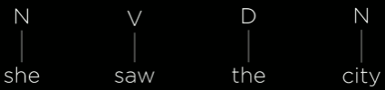
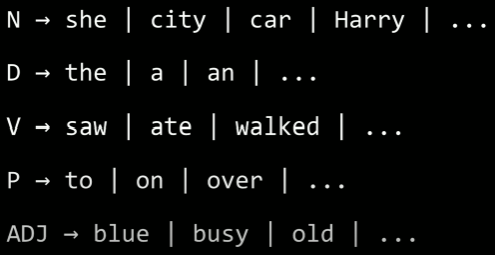
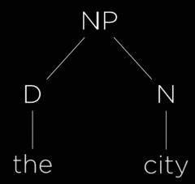
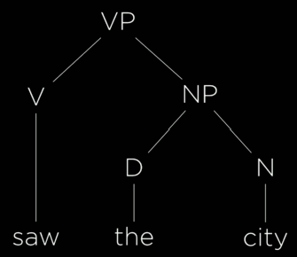
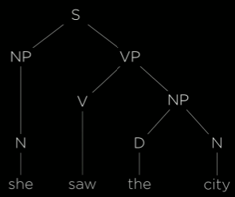
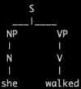
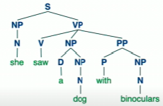
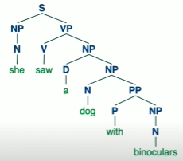

# Language - CS50AI Lecture 6

## Natural Language Processing:

Algorithms that allow our AI to process and understand natural language

- Automatic summarization
- information extraction
- language identification
- machine translation
- named entity recognition
- speech recognition
- text classification
- word sense disambiguation
- ...

## Syntax and Semantics:

Just like programming languages have their own specific syntax, the languages we humans speak have their own syntax(grammar). For example, we can agree that the following sentence has good grammar,"just before nine o'clock, Sherlock Holmes stepped briskly into the room." However, this sentence does not have good grammar, "Just before Sherlock Holmes nin o'clock stepped briskly the room."

Then, there's the idea of semantics. The idea of what do sentences actually mean? "Just before nine o'clock Sherlock Holmes stepped briskly into the room." has a different structure than "Sherlock Holmes stepped briskly into the room just before nine o'clock" but they mean the same thing. We can also have a sentence that is grammatically correct but means absolutely nothing: "Colorless green ideas sleep furiously." This problem can get complicated very quickly.

## Context-Free Grammar:

**Generating sentences in a language using symbols and rewriting rules.**

Represent each word as a terminal symbol and assign a non-terminal symbol to each terminal symbol.



To Help us translate non-terminal symbols into terminal symbols where the "|" represents possible choices for that non-terminal symbol.



New non-terminal symbols can be contstructed using existing non-terminal symbols.
- A noun phrase = a noun OR a determiner followed by a noun: `NP -> N | D N`.
- A verb phrase = a verb OR a verb followed by a noun phrase: `VP -> N | V NP`.
- Sentence = noun phrase followed by a verb phrase: `S -> NP VP`


### Syntax Trees:

Using language syntax trees, we can start to see the structure of language from while assembing sentences and/or phrases. Here are some examples.

Noun Phrase: Determiner followed by a noun



Verb Phrase: A verb followed by a noun phrase



A Sentence: Noun phrase followed by a verb phrase



## Natural Language Took Kit (nltk):

A useful python library for natural language processing.

```python
import nltk

grammar = nltk.CFG.fromstring("""
    S -> NP VP

    NP -> D N | N
    VP -> V | V NP

    D -> "the" | "a"
    N -> "she" | "city" | "car"
    V -> "saw" | "walked"
""")

parser = nltk.ChartParser(grammar)

sentence = input("Sentence: ").split()
try:
    for tree in parser.parse(sentence):
        tree.pretty_print()
        tree.draw()
except ValueError:
    print("No parse tree possible.")
```
As a simple example, running the above code with input "she walked" would give us the output:



This is still a very basic example but we can start to see how this process can get complicated very quickly. If we were to increase the grammar knowledge, more sentences and sentence structures can be formed:

```
S -> NP VP

AP -> A | A AP
NP -> N | D NP | AP NP | N PP
PP -> P NP
VP -> V | V NP | V NP PP

A -> "big" | "blue" | "small" | "dry" | "wide"
D -> "the" | "a" | "an"
N -> "she" | "city" | "car" | "street" | "dog" | "binoculars"
P -> "on" | "over" | "before" | "below" | "with"
V -> "saw" | "walked"
```

nltk also has the ability to show us all possible sentence structures, that is to say, the sentence "she saw a dog with binoculars" can be represented as:



OR:



## _n_-gram

A contiguous sequence of _n_ items from a sample of text.

- Unigram: A continuos sequence of 1 item from a sample of text - _n_ = 1.
- Bigram: A continuos sequence of 2 items from a sample of text - _n_ = 2.
- Trigram: A continuos sequence of 3 items from a sample of text - _n_ = 3.
- Character _n_-gram: A contiguous sequence of _n_ characters form a sample text.
- Word _n_-gram - A contiguous sequence of _n_ words form a sample text.

Ex. Trigrams in "I'm learning a lot in CS50AI."

1) "I'm learning a"
2) "learning a lot"
3) "a lot in"
4) "lot in CS50AI"

Why might this be useful? Often when computers analyze text, they don't look at the whole text at once. Even we humans read word by word or phrase by phrase. With the above approach there is a likelihood that the AI has never seen this exact text before but it could have seen phrases like "learning a lot." 

## Tokenization:

The task of splitting a sequence of characters into pieces (tokens)

- Word tokenization: the task of splitting a sequence of characters into words.

## Markov Models:

We've seen markov models before and we can use them to predict words that might appear in a sentence. For example, each unit(or previous _x_ units) can predict what the value of the following unit will be based on tokenization information.


## Text Categorization:

Classifying text into categories.

Example: Given a sentence, is it positive or negative.
- 😃 "My grandson loved it! So much fun!"
- 🙁 "Product broke after a few days."
- 😃 "One of the best games I've played in a long time."
- 🙁 "Kind of cheap and flimsy, not worth it."

Example: Given words in an email classify the email as either words or spam.


### Bag-of-Words Model:

Model that represents text as an unordered collection of words. In this case, ignore sentence meaning and just search for key words.

## Naive Bayes:

Recall that Bayes' Rule is:

<p align="center">
  
</p>

Given a comment, we want to be able to say: what is the probability it is positive - _P_(😃) and what is the probability it is negative - _P_(🙁). We can formulate this using conditional probability by saying _P_(😃 | "My grandson love it") or, _P_(😃 | "My", "grandson", "loved", "it"). In this case, _b_ = 😃 and _a_ = "My", "grandson", "loved", "it".

**Using Bayes' Rule,** 

_P_(😃 | "My", "grandson", "loved", "it") = _P_("My", "grandson", "loved", "it" | 😃)_P_(😃) / _P_("My", "grandson", "loved", "it")

We can further simplify the above equation because we aren't exactly looking for exact probabilities. Since the denominator is the same regardless of + or -, we can formulat it using joint probabilities:

_P_(😃, "My", "grandson", "loved", "it") = _P_(😃)_P_("My" | 😃)_P_("grandson" | "My", 😃), etc...

Now, this approach raises a few concerns. You can imagine if we wanted to find out _P_("grandson") it would be quite hard and aribitrary to do that just being given "My" and 😃. Instead, we can treat each word as a separapte probability which means that the probability of "grandson" being in the sentence if it's 😃 won't change even if other words are present.

_P_(😃, "My", "grandson", "loved", "it") is naively proportional to _P_(😃)_P_("My" | 😃)_P_("grandson" | 😃)_P_("loved" | 😃), etc...

### Calculation:

_P_(😃) = number of positive samples / number of total samples.  
_P_("loved" | 😃) = number of positive samples with "loved" / number of positive samples

**Let's calculate the probabilites**

Sentence:  
_P_(😃)_P_("My" | 😃)_P_("grandson" | 😃)_P_("loved" | 😃)_P_("it" | 😃)

Known Probabilites:

| 😃 | 🙁 |
|-----|----|
| 0.49| 0.52|

| | 😃 | 🙁 |
|----|-----|----|
| my | 0.30| 0.20|
| grandson | 0.01| 0.02|
| loved | 0.32| 0.08|
| it | 0.30| 0.40|

Using the able probabilites we can compute the joint probability for the above sentence which turns out to be: 😃 - 0.00014112. Alone, this number doesn't give us much information so we then compute a similar joint probability but multiply all the negative values instead. This gives us the value 🙁 - 0.00006528. After normalizing the values, we get:

😃 = 0.6837
🙁 = 0.3183

We are 68.37% confident that the above sentence is positive. Once again, there are downsides to this approach. Let's say the probability of "grandson" occuring in a positive sentence was 0.00. Our final probability would result in 0 which isn't exactly accurate because we are essentially ignoring all the other probabilities. Below are some possible solutions.

### Additive Smoothing:

Adding a value _α_ to each value in our distribution to smooth the data.

### Laplace Smoothing:

Adding 1 to each value in our distribution. Pretending we've seen each vale one more time than we actually have.

### Summary:

The main goal of naive bayes is to ignore words that appear to be equally likely in both positive and negative sentences. What really makes the difference when it comes to classification is when a probability for one word is much higher for one sentiment rather than another.