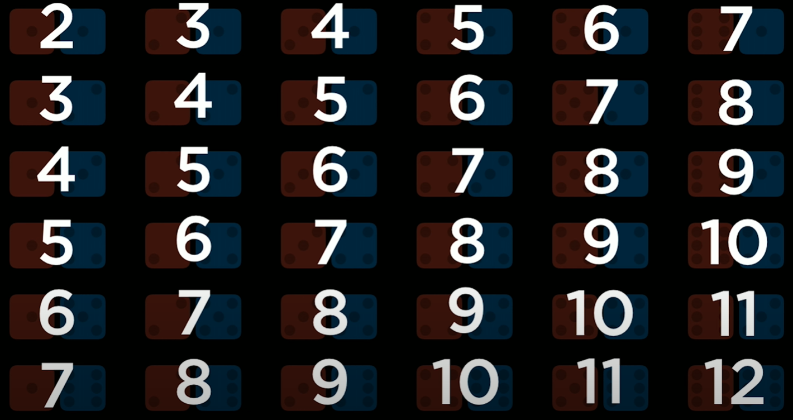
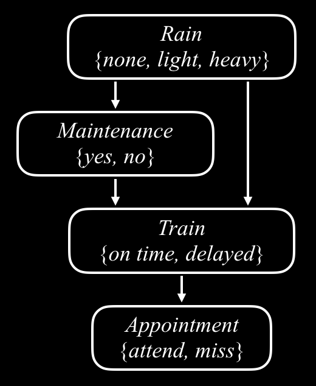
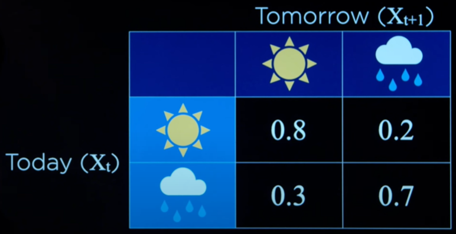
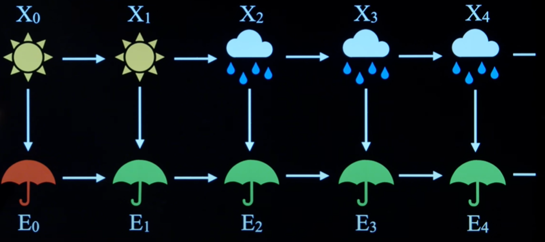

# Uncertainty - CS50AI Lecture 2

## Probability Theory:

In a dice, there are 6 possible worlds: 1, 2, 3, 4, 5, and 6. Each world has a probability of being true and we can represent both the world and its probability by doing the following.

 -> A possible world  
 -> The probability of world $\omega$ being true where $0$ ≤ _P($\omega$)_ ≤ $1$.

The sum of all _P($\omega$)_ has to be equal to 1. Logically, this tells us that something thing will be true. In the dice example, it is guaranteed that we will get a number $x$ where 1 ≤ $x$ ≤ 6. We can represent this with the equation:

$$\sum_{\omega \in \Omega} P(\omega) = 1$$

Tthe sum of the probabilities of all possible worlds will be equal to $1$.

In a more complex model, it's not always the case that each world is equally as likely.  
Example:  

In this example, although each world is equally likely(a combination of dice rolls), the sum of the rolls are not.
There are $6$ possible worlds where $7$ is the sum but only $1$ possible world where the sum is $12$. We can represent this using the following.

$P(12) = \frac{1}{36}$ --> Only $1$ out of the $36$ worlds have a sum of $12$.  
$P(7) = \frac{6}{36} = \frac{1}{6}$ --> $6$ worlds have a sum of $12$.

## Unconditional Probability:

Degree of belief in a proposition in the absence of any other evidence.

## Conditional Probability:

Degree of belief in a proposition given some evidence that has already been revealed.

Probability that $a$ is true given $b$.  
$P(a | b)$ 

All cases where a and b are true with the exception of b being true.  
$$P(a | b) = \frac{P(a ∧ b)}{P(b)}$$  
or,  
$$P(a ∧ b) = P(a | b)*P(b)$$  

Example: In the image above, the probability of the sum being $12$ given a red die with value $6$.

$a = 12$: the $a$ value in the above equation is $12$.  
$b = r6$: the $b$ value in the above equation is a red $6$ die.

First, the probability of red being $6$ is $\frac{6}{36} = \frac{1}{6}$. Next, we need the probability of both $a$ and $b$ being true which is $\frac{1}{36}$ because only $1$ world has a sum of $12$ with red being $6$. Finally, we divide these two to get the probability of both $a$ and $b$ being true.

$P(a | b) = \frac{\frac{1}{36}}{\frac{1}{6}} = \frac{1}{6}$  
Therefore, given that the red die rolled $6$, the probability of the sum being $12$ is $\frac{1}{6}$.

## Random Variables:

A variable in porbability that has a domain of values that it can be

Ex: _Roll = {1, 2, 3, 4, 5, 6}_    
Ex: _Weather = {sum, cloud, rain, wind, snow}_  
Ex: _Traffic_ = _{none, light, heavy}_  
Ex: _Flight = {on time, delayed, cancelled}_  

### Probability Distribution:

Ex: _P_(_Flight_ = _on time_) = $0.6$  
Ex: _P_(_Flight_ = _delayed_) = $0.3$  
Ex: _P_(_Flight_ = _cancelled_) = $0.1$

This can be represented using a vector: A sequence of values(interpreted in order).  
**P**(_Flight_) = <$0.6$, $0.3$, $0.1$>

## Independence:

The knowledge that one event occurs does not affect the probability of other events.  
Ex: The red die roll does not influence the blue die roll.  
Ex: Clouds and rain are most likely not independent.

If independent,  
$P(a ∧ b) = P(a)*P(b)$

Ex of Independence:  
$P(red6 ∧ blue6) = P(red6)*P(blue6)$  
$= \frac{1}{6} * \frac{1}{6} = \frac{1}{36}$

Ex of Non-Independence:  
$P(red6 ∧ red4) \neq P(red6)*P(red4)$  

There is no way you can get $4$ if you get $6$. Therefore the event that red rolls $6$ and the event that red rolls $4$ are non-independent.

## Bayes' Rule:

### Derivation:

Given:  
$$P(a ∧ b) = P(a | b)*P(b)$$  
and
$$P(a ∧ b) = P(b | a)*P(a)$$  
We can use substitution to derive Bayes' Rule.  
$$P(b | a)*P(a) = P(a | b)*P(b)$$  
Divide by $P(a)$ to get:  
$$P(b | a) = \frac{P(a | b)*P(b)}{P(a)}$$

This is useful when one probability is easier to know than another probability. Knowing _P(visible effect | unknown cause)_, we can calculate _P(unkown cause | visible effect)_.

## Joint Probability:

**AM:** 
| _C = cloud_   | _C = ¬cloud_  |
| ------------- | ------------- |
|     $0.4$     |     $0.6$     |

**PM:**  
| _R = rain_   | _R = ¬rain_   |
| ------------ | ------------- |
|     $0.1$    |     $0.9$     |

**AM & PM:**
|              | _R = rain_   | _R = ¬rain_   |
| ------------ | ------------ | ------------- |
| _C = cloud_  |    $0.08$    |    $0.32$     |
| _C = ¬cloud_ |     $0.02$   |     $0.58$    |

Probability of clouds given it is raining(`,` and `∧` are used interchangably).  
$$P(C | rain) = \frac{P(C, rain)}{P(rain)} = \alpha P(C, rain)$$

Conditional distribution of $P(C | rain)$ is proportional to the joint probability of $\alpha P(C, rain)$ where $\alpha = <0.08, 0.02>$(cloud probability given it's raining). Equivalently, $\alpha = <0.8, 0.2>$ to reach a sum of $1$.

### Negation:

$P(¬a) = 1 - P(a)$

The probability of $¬a$ happening is 1 - the probability of $a$ happening.

### Inclusion-Exclusion:

$P(a ∨ b) = P(a) + P(b) - P(a ∧ b)$

The probability of $a$ or $b$ being true is the the probability of $a$ being true plus the probability of $b$ being true - the probability of both $a$ and $b$ being true.

### Marginalization:

$P(a) = P(a, b) + P(a, ¬b)$

This formula helps find the probability of $a$ using some other information like $b$. Either $b$ is true or $b$ is not true but the probability of $a$ being true is the sum of both these cases. Sometimes $b$ could take the form of a random variable where there are multple possible values. Now, we have to sum up all the possible values that $b$ could take. This can be represented as follows:

$$P(X = x_i) = \sum_{j} {P(X = x_i, Y = y_i)}$$

### Conditioning:

$P(a) = P(a | b)P(b) + p(a|¬b)P(¬b)$

Similar to margininalization except it uses conditional probability instead of joint probability. Again, there is a version of conditioning that can be applied to random variables.

$$P(X = x_i) = \sum_{j} {P(X = x_i | Y = y_i)P(Y = y_i)}$$

Given variable $Y$, what is the probability that it takes on state $y_i$. We then multiply this by the probability of $X$ taking on the state $x_i$ given $Y$ took on $y_i$.

## Bayesian Network:

Data structure that represents the dependencies among random variables.

- Directed graph
- Each node represents a random variable
- Arrow from _X_ to _Y_ means _X_ is a parent of _Y_
- Each node _X_ has probabillity distribution $P(X|Parents(X))$

Example:  

Description:

**Appointment**: Dependent on Train(1 arrow pointing to it)
**Train**: Dependent on maintenance and Rain(2 arrows pointing to it)
**Maintenance**: Dependent on Rain(1 arrow pointing to it)
**Rain**: Not dependent on anything(no arrows pointing to it)

**Using Bayesian Networks:**

Let's say we wanted to find $P(light, no, delayed, miss)$.  
Maintenance is dependent on rain so we write the probability of maintence taking on the value of $no$ as $P(light)*P(no | light)$.  
The train is dependent on both Rain and Maintenance so we add both `light, no` to the previous expression to get $P(light)*P(no | light)*P(delayed | light, no)$.  
Ultimately, appointment is only dependent on the Train so we add another segment to get the probability of $P(light, no, delayed, miss)$:  

$P(light)*P(no | light)*P(delayed | light, no)*P(miss | delayed)$.

## Inference:

- Query $X$: variable for which to compute distribution.
- Evidence variables $E$: observed variables for event $e$.
- Hidden variables $Y$: non-evidence, non-query variables.

Goal: Calculate $P(X|e)$

Let's say we wanted to find $P(Appointment | light, no)$  
Query: $Appointment$  
Evidence: $light$, $no$  
Hidden: $Train$  

We know that a conditional probability is equiavalent to $\alpha$ * joint probability.  
$$P(Appointment | light, no)$$
$$ = \alpha P(Appointment, light, no)$$  
Either the train is on time, or the train is delayed:  
$$ = \alpha [P(Appointment, light, no, on-time)] + P(Appointment, light, no, delayed)$$

### Inference by Enumeration:

$$P(X | e) = \alpha P(X, e) = \alpha \sum_{y} {P(X, e, y)}$$

$X$ is the query variable.  
$e$ is the evidence.  
$y$ ranges over values of hidden variables.  
$\alpha$ normalizes the result.

## Sampling:

### Conditional Sampling:

Randomly choose a world for one of the random variables. Every variable from that point is chosen based on this value. Now, if we run this sampling simulation many many times, we can choose the results where the query is true and estimate the probability rather than computing every possible case.

### Unconditional Sampling:

This works similar to conditional sampling except we reject the worlds where the evidence is not satisfied and choose the ones where it is.

**Problems with Sampling**: If a world is very unlikely to occur, a lot of computation is wasted.

### Likelihood Weighting:

- Start by fixing the values for evidence variables
- Sample the non-evidence variables using conditional probabilities in the Bayesian Network
- Eight each sample by its **likelihood**: the probability of all the evidence.

## Markov Model:

### Markov Assumption:

The assumption that the curent state depends on only a finite fixed number of previous states.

### Markov Chain:

A sequence of random variables where the distribution of each variable follows the Markov assumption.  
  

**Transition Model:** Transition from one state to another state.

Given today's weather, predict tomorrow's weather. Use tomorrow's weather to predict the day after's weather and so on...

## Hidden Markov Model:

A Markov model for a system with hidden states that generate some observed event.  
Sensor Model:  
  
In this case, we aren't directly observing umbrellas but we are using sun and rain to predict something that is "hidden."

### Sensor Markov Assumption:

The assumption that the evidence variable depends only on the corresponding state.

**Filtering**: Given observations from start until now, calculate probability for the current state.  
**Prediction**: Given observations from start until now, calculate probability for a future state.  
**Smoothing**: Given observations from start until now, calculate probability for a past state.  
**Most Likely**: Given observations from start until now, calculate most likely sequence of states.